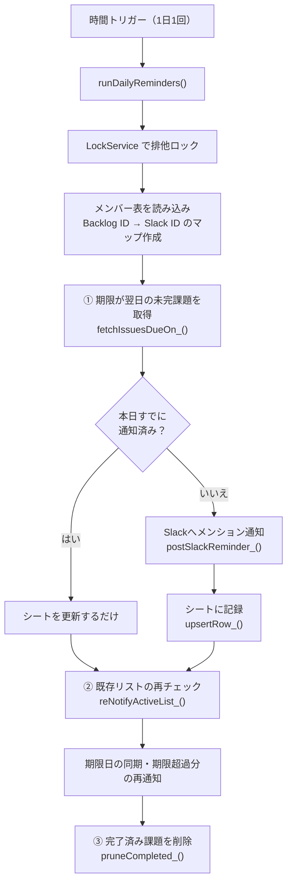

# legal-deadline-reminder

Backlog の課題の**期限日が近づいたら、担当者を Slack でメンションして通知する** Google Apps Script です。
通知した課題はスプレッドシートに一覧として蓄積され、完了になった課題は自動で一覧から削除されます。

---

## 1. 何をする仕組みか

1. 毎日1回、Backlog API で「**期限日が翌日の未完課題**」を取得する
2. 担当者の Backlog ユーザーIDを、スプレッドシートの `メンバー表` を使って Slack ユーザーIDに変換する
3. Slack の指定チャンネルに、担当者をメンションしてリマインドを投稿する
4. 通知内容を `期限通知リスト` シートに記録（同じ課題なら上書き更新）
5. すでに一覧に載っている課題も毎日 Backlog から最新情報を取り直し、**期限日が変更されていれば追随**、期限を過ぎていれば再通知する
6. ステータスが完了になった課題は一覧から行ごと削除する

同じ課題に**1日2通は送りません**。`最終通知日` 列とスクリプトプロパティの2重チェックで重複を防いでいます。

---

## 2. 処理の流れ



---

## 3. 設定値

ファイル冒頭にまとめて定義されています。

| 定数 | 内容 |
| --- | --- |
| `BACKLOG_SPACE` | Backlog のスペース名（URL の `https://<ここ>.backlog.com`） |
| `BACKLOG_API_KEY` | Backlog API キー |
| `BACKLOG_PROJECT_ID` | 監視対象のプロジェクトID |
| `SLACK_BOT_TOKEN` | Slack Bot User OAuth Token（`xoxb-` で始まる） |
| `SLACK_CHANNEL_ID` | 通知先チャンネルID |
| `SPREADSHEET_ID` | 管理用スプレッドシートのID |
| `SHEET_NAME` | 通知リストのシート名（`期限通知リスト`） |
| `MEMBER_SHEET_NAME` | メンバー対応表のシート名（`メンバー表`） |
| `REMIND_DAYS_BEFORE` | 何日前に通知するか（`1` = 前日通知） |
| `COMPLETE_STATUS_NAMES` | 完了とみなすステータス名（`完了` / `Closed` / `Resolved`） |

タイムゾーンは全処理で `Asia/Tokyo` 固定です。

---

## 4. スプレッドシートの構成

### `期限通知リスト`（スクリプトが自動生成・更新）

ヘッダー行が想定と違う場合は、起動時に自動で上書きされます。

| 列 | 項目 | 内容 |
| --- | --- | --- |
| A | 課題キー | 一意キー。行の特定に使用 |
| B | 件名 | 課題のサマリー |
| C | 期限日 | `yyyy-MM-dd`。Backlog 側で変更されると毎日同期される |
| D | 担当者ID | Backlog のユーザーID |
| E | 担当者名 | — |
| F | SlackユーザーID | メンバー表から引いた値。手入力された値も優先して保持 |
| G | ステータス | Backlog のステータス名 |
| H | 最終通知日 | 重複通知の防止に使用 |
| I | 課題リンク | Backlog の課題URL |
| J | 登録者 | 課題の作成者（`createdUser`） |

### `メンバー表`（手動でメンテナンス）

Backlog ユーザーID と Slack ユーザーID の対応表です。**列の順番は問いません。**
1行目のヘッダーに `backlog` / `slack` という文字列が含まれる列を自動で探して読み取ります（大文字小文字を区別しません）。

両方が埋まっている行だけがマップに登録されるため、**Slack ID が空のメンバーは通知対象外**になります。

---

## 5. 通知メッセージ

期限日との比較で文面が3パターンに切り替わります。

| 状況 | 文面 |
| --- | --- |
| 期限日を過ぎている | ⚠️ 期限日が過ぎています！ |
| 期限日が当日 | ⏰ 本日が期限日です！ |
| それ以外（翌日など） | ⏰ 期限が近づいています！ |

送信例:

```
⏰ <@U01ABCDEFG> 期限が近づいています！
📌 *課題*: <https://xxx.backlog.com/view/PROJ-123|契約書レビュー依頼>
📅 *期限日*: 2026/09/25
👤 *担当*: 山田 太郎
```

投稿先は担当者個人のDMではなく、**`SLACK_CHANNEL_ID` の1チャンネルに集約**されます。担当者はメンションで呼び出される形です。

---

## 6. 関数一覧

### メイン

| 関数 | 役割 |
| --- | --- |
| `runDailyReminders()` | エントリーポイント。トリガーはこれに設定する |
| `reNotifyActiveList_()` | 既存リストの再チェック・期限日同期・期限超過分の再通知 |
| `pruneCompleted_()` | 完了済み課題の行を削除 |

### Slack / Backlog

| 関数 | 役割 |
| --- | --- |
| `postSlackReminder_()` | `chat.postMessage` で通知を投稿。成功時に送信済みフラグを立てる |
| `fetchIssuesDueOn_()` | 指定日が期限の未完課題を一覧取得（最大100件） |
| `fetchIssueByKey_()` | 課題キー1件から最新情報を取得 |
| `isCompleted_()` | ステータス名が完了リストに含まれるか判定 |

### スプレッドシート

| 関数 | 役割 |
| --- | --- |
| `getOrCreateSheet_()` | シートの取得（なければ作成）とヘッダーの整備 |
| `findRowByIssueKey_()` | 課題キーから行番号を検索 |
| `headerIndexMap_()` | ヘッダー名 → 列インデックスのマップ作成 |
| `upsertRow_()` | 既存行があれば上書き、なければ追記 |
| `loadUserMappingFromSheet_()` | メンバー表から Backlog ID → Slack ID のマップを作成 |

### ユーティリティ

| 関数 | 役割 |
| --- | --- |
| `hasAlreadySentToday_()` / `markSentToday_()` | スクリプトプロパティによる当日送信済み判定 |
| `getFutureDateJST_()` | N日後の日付を `yyyy-MM-dd` で返す |
| `formatDateJST_()` | 日本時間での日付フォーマット |
| `escapeMarkdown_()` | `&` `<` `>` をHTMLエスケープ（Slackの記法崩れ対策） |

---

## 7. セットアップ

1. **Slack App を作成**し、Bot Token Scopes に `chat:write` を付与。ワークスペースにインストールして `xoxb-` トークンを取得
2. **Bot を通知先チャンネルに招待する**（招待しないと投稿が失敗します）
3. **Backlog API キーを発行**（個人設定 → API）
4. スプレッドシートに **`メンバー表` シートを作成**し、Backlog ユーザーID と Slack ユーザーID を並べる
5. ファイル冒頭の設定値を埋める
6. GAS エディタから `runDailyReminders` を手動実行し、権限を承認（スプレッドシート／外部リクエスト）
7. **トリガーを追加**：`runDailyReminders` を「日付ベースのタイマー」で1日1回実行

`期限通知リスト` シートは初回実行時に自動作成されるため、事前に作る必要はありません。

---

## 8. 多重実行の防止

`LockService.getScriptLock()` で30秒待機のロックを取ります。取得できなければ何もせず終了するため、トリガーが重なっても二重投稿は起きません。
